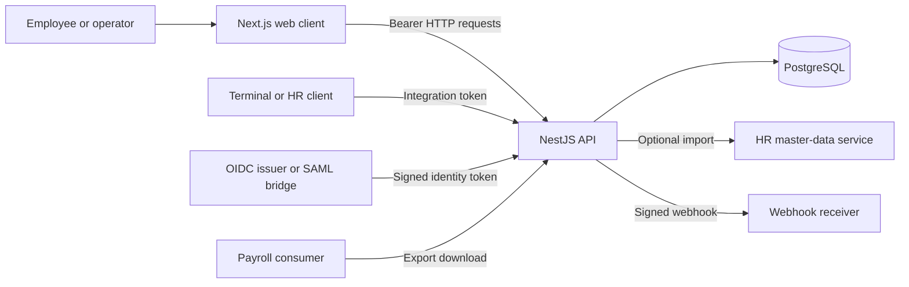
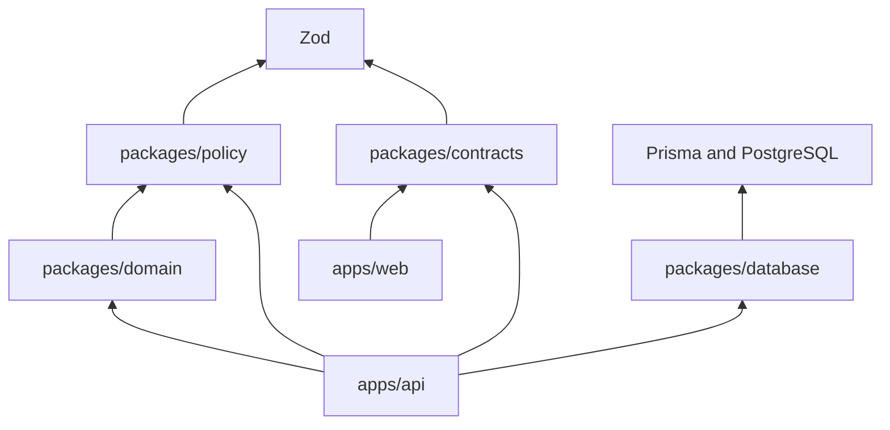
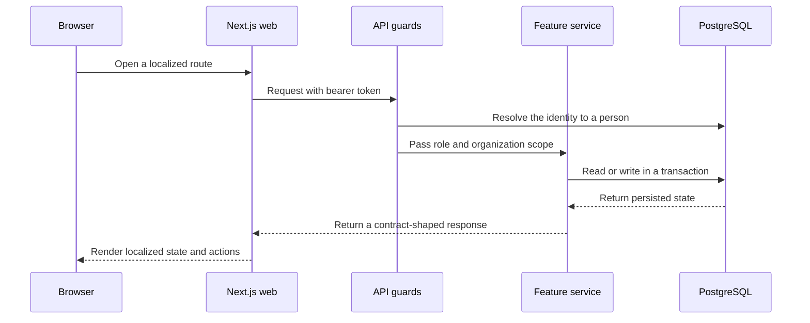

# Architecture

cueq is a TypeScript modular monolith for time recording, absence management,
shift planning, and related university HR work. The repository contains two
runtime applications, a Next.js web client and a NestJS API, plus shared
packages for contracts, policy, domain rules, and PostgreSQL access.

The API is the security and transaction boundary. The web client may hide or
show navigation based on the signed-in role, but every operation is authorized
again by the API.

## System overview



Identity providers, physical terminals, HR systems, payroll consumers, webhook
receivers, TLS termination, and network controls are supplied by the deployment
environment. The static GitHub Pages demo under `docs/demo` uses deterministic
browser data and does not connect to the application.

## Repository layers

The runtime code is split by responsibility:

- `apps/web` contains locale-aware routes, browser preferences, shared UI, and
  the HTTP client.
- `apps/api` contains authentication, authorization, transactions, scheduled
  work, and the application features.
- `packages/contracts` defines Zod request, response, and event schemas shared
  by the applications.
- `packages/policy` contains versioned workforce policies.
- `packages/domain` contains pure calculations and state machines for time,
  absence, rosters, workflows, closing, and audit behavior.
- `packages/database` owns the Prisma schema, migrations, client, seed data,
  imports, document storage, and recovery tools.
- `schemas/domain` contains the JSON Schemas used to generate the domain schema
  index and TypeScript bindings.

The shared packages are private workspace dependencies. PostgreSQL is required
to run the API; the repository's Compose file starts only a local PostgreSQL
instance.

Dependencies point inward:



`packages/domain` must not depend on NestJS, Prisma, HTTP, browser, filesystem,
or process APIs. Contracts and policy depend on Zod but no other workspace
package. The database package handles persistence rather than domain or HTTP
orchestration. `scripts/check-architecture.mjs` checks these rules, package and
feature cycles, retired paths, public feature imports, and selected ownership
boundaries.

## API modules

`apps/api/src/app.module.ts` is the composition root. Authentication, HTTP
policy, validation, and transactions live under `apps/api/src/platform`;
Prisma lifecycle code lives under `apps/api/src/persistence`.

Application features live under `apps/api/src/modules`:

```text
absence       attendance    audit          closing       documents
integrations  lifecycle     people         policy        projects
reporting     scheduling    session        workflows
```

A feature owns its controllers, application services, and internal helpers.
Another feature imports from its `public.ts` file instead of reaching into its
internals. Writes to an aggregate owned by another feature go through a narrow
application port implemented by that owner.

The workflows feature decides and coordinates effects on absences, bookings,
and rosters through those ports. Absence and closing use the smaller
`modules/workflows/workflow-runtime.public.ts` API for assignments and state
queries. This keeps the NestJS module graph acyclic without `forwardRef`.
Reporting and integrations expose data or protocols but do not take ownership
of the underlying business records.

## A typical request



Some flows add more coordination:

- attendance, absence, and scheduling writes may also create workflow, audit,
  or outbox records in the same feature-owned transaction;
- workflow decisions call feature-owned ports to apply their effects;
- workflow escalation and closing cut-off scans run hourly in the API process;
- an administrator starts a finite webhook dispatch, while startup recovery and
  30-second polling resume existing jobs without creating new ones;
- terminal batches use a separate integration token and apply locking,
  ordering, and idempotency checks;
- HR data can arrive through the token-protected API, a configured HTTP
  provider, or the database package's CSV command; and
- closing creates payroll export artifacts that authorized clients download
  through the API.

## Contracts and data

NestJS controllers and Swagger decorators define the HTTP API. The generated
snapshot at `contracts/openapi/openapi.json` is the committed review artifact,
while `packages/contracts` supplies runtime Zod validation. Swagger UI is
available at `/api/docs` outside production and disabled in production.

Prisma models and migrations live under `packages/database/prisma`. They cover
people, employment appointments, organization units, bookings, absences,
rosters, workflows, closing periods, time accounts, audit entries, outbox
events, webhook attempts, terminal health, HR imports, projects, lifecycle
plans, private-document metadata, and export artifacts. Encrypted document
objects use the database package's filesystem adapter. See the
[university HR guide](docs/UNIVERSITY-HR.md) for the appointment and personnel
model.

Related writes use Prisma transactions when state, audit, or outbox updates
must be atomic. A committed database trigger rejects `UPDATE` and `DELETE` on
audit rows. It does not provide cryptographic tamper evidence or protect against
a privileged database administrator or `TRUNCATE`.

## Generated files

`make generate` produces three committed files:

- `contracts/openapi/openapi.json` from the built NestJS application;
- `docs/generated/db-schema.md` from the JSON Schemas in `schemas/domain`; and
- `packages/domain/src/generated/schema-contracts.ts` from the same schemas.

Despite its name, `docs/generated/db-schema.md` indexes domain JSON Schemas; it
is not a rendering of the Prisma schema. Change the owning source and regenerate
these files instead of editing them directly.

## Deployment

Turborepo builds shared packages before the applications. The production start
commands run built API and web output, but they do not migrate the database,
terminate TLS, supervise processes, or roll back a release. The API reads its
environment from the process; the web application follows Next.js environment
file handling.

This repository has no application Dockerfile, published image, production
topology, secret manager, monitoring stack, alert delivery, or backup-retention
policy. [Operations](docs/OPERATIONS.md) and [Security](docs/SECURITY.md) list
what a deployment must provide. [ADR-002](docs/design-decisions/002-deployment-strategy.md)
records why deployment infrastructure remains outside this repository.

## Making architectural changes

- Put new API behavior in the feature that owns the affected records.
- Expose deliberate cross-feature APIs through `public.ts` or an application
  port.
- Put deterministic calculations in `packages/domain` and data-driven rules in
  `packages/policy`.
- Add HTTP and event shapes to `packages/contracts`, then regenerate and review
  OpenAPI.
- Change persisted data through the Prisma schema and a committed forward
  migration.
- Keep provider and transport code in integrations rather than the domain
  package.
- Add user-visible text to both German and English message catalogs.

[ADR-005](docs/design-decisions/005-modular-monolith-boundaries.md) explains the
modular-monolith choice. [Capabilities](docs/product-specs/README.md) describes
the product behavior implemented by these modules.
