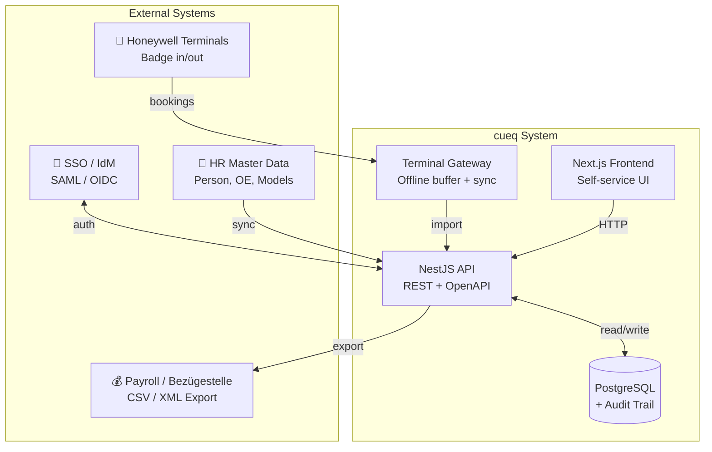
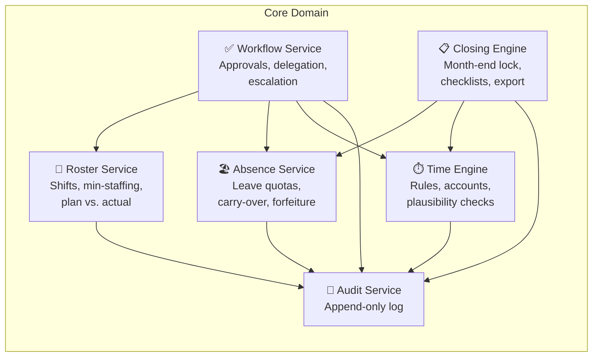
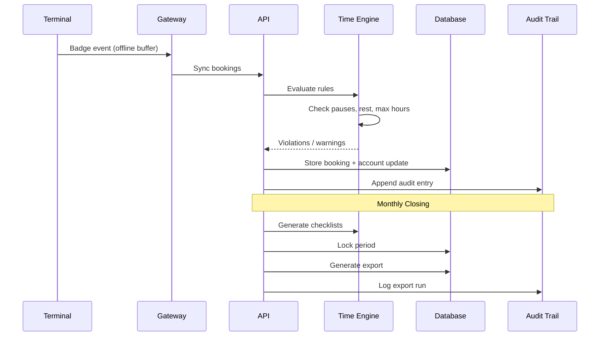
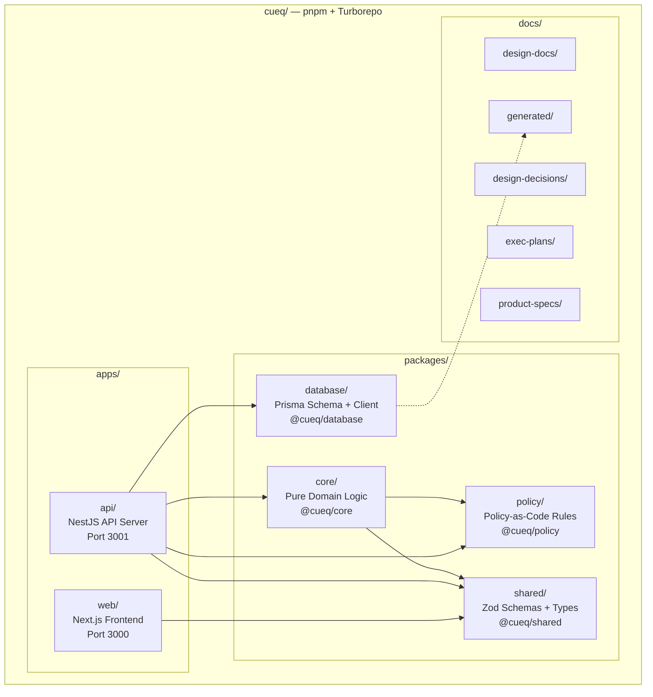
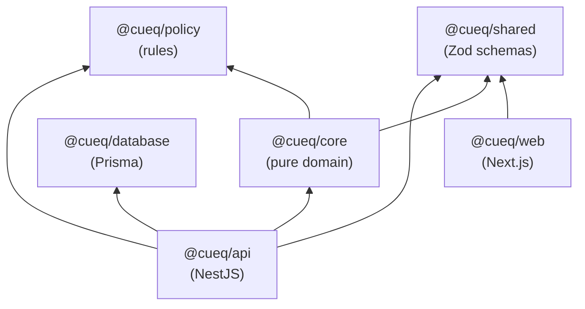
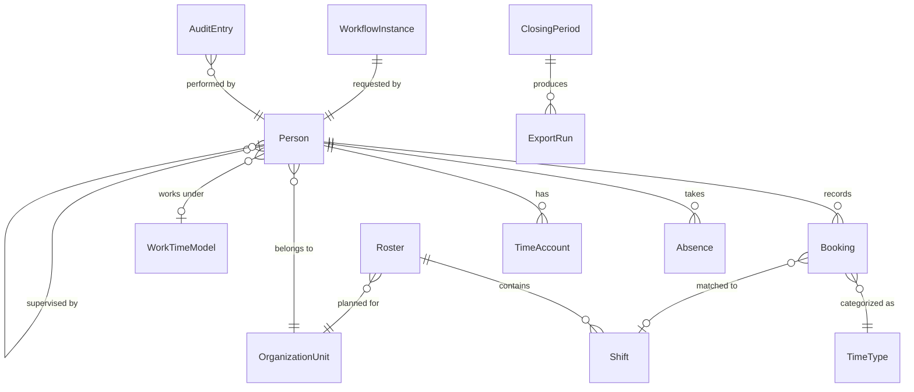

# cueq

> **Integrated time-tracking, absence-management, and shift-planning system** for a German university (NRW / TV-L).

[](LICENSE)

---

## What is cueq?

**cueq** (pronounced "cue-Q") is a workforce-management system built for German universities operating under the [TV-L](https://de.wikipedia.org/wiki/Tarifvertrag_f%C3%BCr_den_%C3%B6ffentlichen_Dienst_der_L%C3%A4nder) collective agreement in [Nordrhein-Westfalen (NRW)](https://de.wikipedia.org/wiki/Nordrhein-Westfalen). It replaces fragmented tools (paper, Excel, disconnected terminal systems) with a single, legally compliant, auditable, and user-friendly system.

### The Problem

Universities have diverse workforce models under one roof:

- **Office administration** — flextime (Gleitzeit) with core hours
- **Security desk (Pforte)** — 24/7 shift operations with minimum staffing
- **IT department** — regular hours plus on-call rotations (Rufbereitschaft) with callout events
- **Facility services (Hausdienst)** — shifts, outdoor assignments, seasonal peaks (e.g. winter service)
- **Event technology (Veranstaltungstechnik)** — irregular evenings/weekends, setup/teardown time

Each group has different rules for working time, surcharges, leave quotas, and shift planning — all governed by TV-L, NRW labor law, and internal works agreements (Dienstvereinbarung). Currently, there is no integrated system that handles all of these correctly, transparently, and with proper audit trails.

### The Solution

cueq provides:

| Capability             | Description                                                                                                                      |
| ---------------------- | -------------------------------------------------------------------------------------------------------------------------------- |
| **Time Recording**     | Honeywell terminal integration (badge in/out) + web self-service for corrections, remote work, on-call deployments               |
| **Rule Engine**        | Configurable rules for pause enforcement, rest periods, maximum hours, overtime — per employee group                             |
| **Shift Planning**     | Roster creation with templates, rotations, minimum staffing, qualification requirements, and plan-vs-actual comparison           |
| **Absence Management** | Leave requests with quota tracking (pro-rata, carry-over, forfeiture), sick-leave recording, team calendar with privacy controls |
| **Approval Workflows** | Configurable approval chains with delegation, escalation, and automatic deputy routing                                           |
| **Monthly Closing**    | Structured end-of-month process: checklists, locking, HR corrections, and payroll export                                         |
| **Audit Trail**        | Immutable, append-only log of every change, decision, and export — required for legal compliance                                 |
| **GDPR Compliance**    | Role-based data access, configurable retention/deletion, no individual performance monitoring                                    |

### Key Constraints

- **No telemetry** — the system never phones home or collects usage analytics
- **Privacy by default** — colleagues see "absent", never "sick"; reports are aggregated to prevent individual identification
- **Works council (Personalrat) compatible** — reporting limits are built into the architecture, not bolted on
- **Offline resilient** — terminals buffer data locally; the system handles sync and conflict resolution

---

## Architecture

### System Context



### Core Domain Services



### Data Flow



---

## Monorepo Structure



### Dependency Graph



### Directory Layout

```
cueq/
├── apps/
│   ├── api/                    # NestJS API server
│   │   ├── src/
│   │   │   ├── main.ts         # Bootstrap + Swagger/OpenAPI setup
│   │   │   ├── app.module.ts   # Root module
│   │   │   └── health/         # Health check controller
│   │   ├── nest-cli.json
│   │   ├── tsconfig.json
│   │   └── package.json
│   └── web/                    # Next.js frontend
│       ├── src/app/
│       │   ├── layout.tsx      # Root layout (lang=de)
│       │   └── page.tsx        # Landing page
│       ├── next.config.ts
│       ├── tsconfig.json
│       └── package.json
│
├── packages/
│   ├── core/                   # Pure domain logic (time, absence, workflow, roster, closing, audit)
│   │   ├── src/core/
│   │   ├── src/index.ts
│   │   └── package.json
│   ├── database/               # Prisma schema + generated client
│   │   ├── prisma/
│   │   │   └── schema.prisma   # 14 models, 10 enums
│   │   ├── src/index.ts        # Re-exports PrismaClient
│   │   └── package.json
│   ├── policy/                 # Policy-as-code definitions + golden tests
│   │   ├── src/rules/
│   │   └── package.json
│   └── shared/                 # Shared validation & types
│       ├── src/
│       │   ├── index.ts
│       │   ├── generated/      # Generated types from JSON Schemas
│       │   └── schemas/
│       │       ├── common.ts   # ID, DateTime, Pagination, ApiError
│       │       ├── booking.ts  # CreateBooking, BookingCorrection
│       │       ├── absence.ts  # CreateAbsence, LeaveBalance
│       │       ├── time-type.ts # TimeTypeCategory, BookingSource
│       │       └── workflow.ts # WorkflowDecision, WorkflowInstance
│       └── package.json
│
├── docs/                       # Full documentation suite
│   ├── design-docs/            # Core beliefs, glossary
│   ├── design-decisions/       # ADRs (template + 001-tech-stack)
│   ├── exec-plans/             # Active plans, completed, tech debt
│   ├── generated/              # Auto-generated (db-schema.md)
│   ├── product-specs/          # Product specifications
│   ├── references/             # Agent context files
│   ├── DESIGN.md               # Design patterns & conventions
│   ├── FRONTEND.md             # Frontend architecture
│   ├── PLANS.md                # Phase 0–3 execution plan
│   ├── PRODUCT_SENSE.md        # Product thinking & personas
│   ├── QUALITY_SCORE.md        # Quality metrics & targets
│   ├── RELIABILITY.md          # Ops, failover, backup
│   └── SECURITY.md             # Threat model, GDPR, RBAC
│
│
├── schemas/                    # JSON Schema source-of-truth contracts
│   ├── domain/                 # Domain entity schemas (Person, Booking, Absence, ...)
│   └── fixtures/               # Fixture schema contracts
│
├── fixtures/                   # Synthetic reference calculation fixtures
│   └── reference-calculations/
│
├── contracts/                  # Checked-in API/schema contracts
│   └── openapi/
│       └── openapi.json        # Committed OpenAPI snapshot
│
├── scripts/                    # Harness scripts used by Makefile/CI
│   ├── setup.sh
│   ├── check.sh
│   ├── schemas.sh
│   ├── generate.sh
│   └── openapi-check.sh
│
├── .github/workflows/ci.yml   # CI: harness validation + fresh-clone smoke
├── docker-compose.yml          # PostgreSQL 16 for local dev
├── Makefile                    # Standard commands interface
├── turbo.json                  # Turborepo build pipeline
├── pnpm-workspace.yaml         # Monorepo workspace config
├── tsconfig.json               # Strict TypeScript base config
├── .prettierrc                 # Code formatting
├── .editorconfig               # Editor consistency
├── .env.example                # Environment template
├── AGENTS.md                   # AI/contributor guide
├── ARCHITECTURE.md             # System architecture
├── README.md                   # ← You are here
└── LICENSE                     # MIT
```

---

## Tech Stack

| Layer          | Technology             | Purpose                                             |
| -------------- | ---------------------- | --------------------------------------------------- |
| **Monorepo**   | pnpm + Turborepo       | Workspace management, parallel builds, caching      |
| **Backend**    | NestJS (TypeScript)    | Modular API framework with built-in OpenAPI support |
| **Frontend**   | Next.js 15 + React 19  | Server-rendered UI with App Router                  |
| **Database**   | PostgreSQL 16 + Prisma | Type-safe ORM with migration management             |
| **Validation** | Zod                    | Runtime validation shared across API + UI           |
| **API Docs**   | @nestjs/swagger        | OpenAPI spec generated from decorators              |
| **Testing**    | Vitest                 | Fast, TypeScript-native test runner                 |
| **CI/CD**      | GitHub Actions         | Automated lint, typecheck, test, build              |
| **Dev Tools**  | Docker Compose         | Local PostgreSQL, reproducible environment          |

See [ADR-001: Tech Stack](docs/design-decisions/001-tech-stack.md) for the full rationale.

---

## Quick Start

```bash
# Prerequisites: Node.js ≥20, pnpm ≥9, Docker

# 1. Clone and configure
git clone https://github.com/your-org/cueq.git
cd cueq
cp .env.example .env

# 2. Setup everything (deps, Docker, Prisma)
make setup

# 3. Start development
make dev
# → Web:     http://localhost:3000
# → API:     http://localhost:3001
# → Swagger: http://localhost:3001/api/docs
```

## Standard Commands

Run `make help` for a full list. Key commands:

| Command              | Description                                                                                        |
| -------------------- | -------------------------------------------------------------------------------------------------- |
| `make setup`         | Install dependencies, start Docker, generate Prisma client, push schema                            |
| `make dev`           | Start API + Web with hot reload                                                                    |
| `make check`         | Full validation: lint + format + typecheck + docs links + schemas/fixtures + tests + OpenAPI drift |
| `make quick`         | Fast local validation: lint + typecheck + unit tests only                                          |
| `make docs-check`    | Validate internal markdown links only                                                              |
| `make lint`          | Run linters (check mode)                                                                           |
| `make lint-fix`      | Auto-fix lint + format                                                                             |
| `make typecheck`     | TypeScript type checking                                                                           |
| `make schemas`       | Validate JSON Schemas and fixture contracts                                                        |
| `make generate`      | Generate Prisma client, OpenAPI snapshot, and generated schema docs                                |
| `make openapi-check` | Compare generated OpenAPI spec against committed snapshot                                          |
| `make test`          | Run all tests                                                                                      |
| `make test-all`      | Run all test suites (unit + integration + acceptance + compliance + backup/restore)                |
| `make build`         | Build all packages and apps                                                                        |
| `make db-generate`   | Regenerate Prisma client after schema change                                                       |
| `make db-migrate`    | Run database migrations                                                                            |
| `make clean`         | Stop Docker, remove artifacts                                                                      |

---

## Domain Model

The database schema models the core domain entities from the [PRD](docs/product-specs/index.md):



---

## Documentation Map

| Document                                                             | Description                                            | Audience                   |
| -------------------------------------------------------------------- | ------------------------------------------------------ | -------------------------- |
| [AGENTS.md](AGENTS.md)                                               | Contributor guide, conventions, security constraints   | Developers, AI agents      |
| [ARCHITECTURE.md](ARCHITECTURE.md)                                   | C4-level system overview, service descriptions         | Developers, architects     |
| [docs/DESIGN.md](docs/DESIGN.md)                                     | DDD patterns, hexagonal architecture, testing strategy | Developers                 |
| [docs/PLANS.md](docs/PLANS.md)                                       | Phase 0–3 execution plan with DoD                      | Project management         |
| [docs/PRODUCT_SENSE.md](docs/PRODUCT_SENSE.md)                       | Personas, success metrics, trade-offs                  | Product, stakeholders      |
| [docs/SECURITY.md](docs/SECURITY.md)                                 | Threat model, RBAC matrix, GDPR compliance             | Security, DPO, Personalrat |
| [docs/RELIABILITY.md](docs/RELIABILITY.md)                           | Availability, backup, failover, monitoring             | Operations                 |
| [docs/QUALITY_SCORE.md](docs/QUALITY_SCORE.md)                       | Coverage targets, test performance budgets             | QA, CI                     |
| [docs/FRONTEND.md](docs/FRONTEND.md)                                 | UI architecture, i18n, accessibility, privacy          | Frontend developers        |
| [docs/design-docs/core-beliefs.md](docs/design-docs/core-beliefs.md) | Design principles + full domain glossary (50 terms)    | Everyone                   |
| [docs/product-specs/](docs/product-specs/index.md)                   | Product specifications                                 | Product, developers        |

---

## Contributing

See [AGENTS.md](AGENTS.md) for the full guide. Key points:

- **Small PRs** — max 400 lines, one concern per PR
- **Conventional Commits** — `type(scope): description`
- **Tests required** — new behavior must have tests
- **No secrets** — use `.env.example` for templates
- **No telemetry** — this is a university system with strict privacy requirements

---

## License

[MIT](LICENSE) — Copyright (c) 2026 Sebastian J. Spicker
