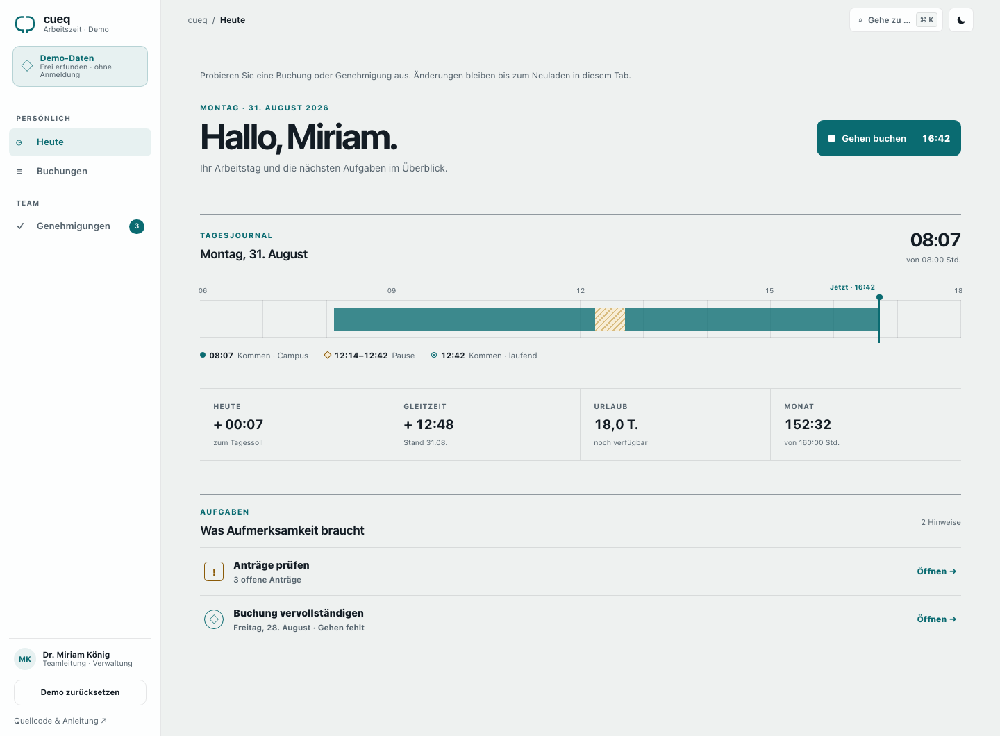
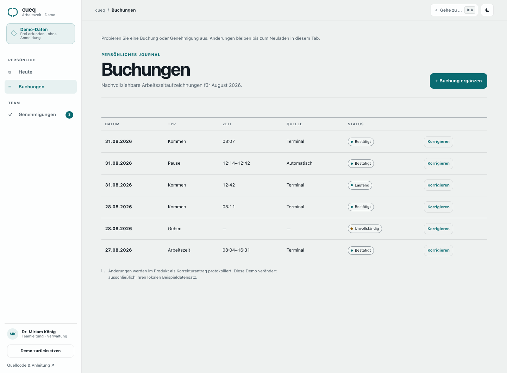
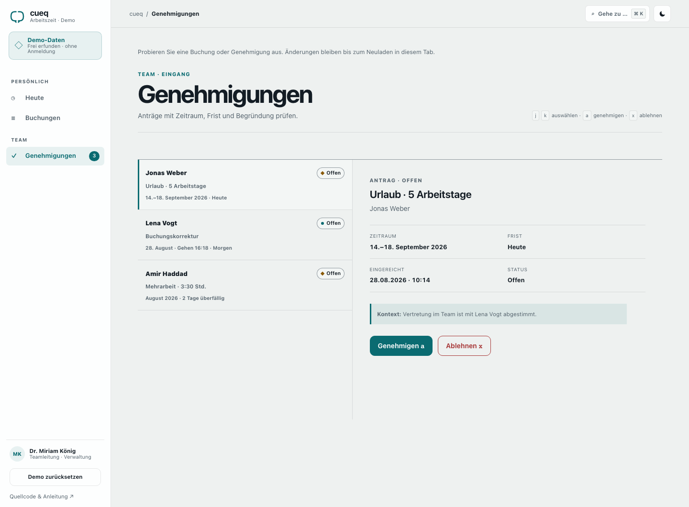

# cueq

cueq is a time and workforce management application for German universities,
built with Next.js, NestJS, and PostgreSQL.

The project is in early development. Use sample data to try it locally. It is
not ready to handle real employee records; see the
[release status](RELEASE_STATUS.md) for current limitations.

Try the [interactive GitHub Pages demo](https://sebastianspicker.github.io/cueq/).
No account or setup is required. All demo records are invented and changes stay
in the current browser tab; the demo does not connect to the API.

## What it covers

- Employees record time, request corrections, and manage leave.
- Team leads review requests and plan rosters and on-call coverage.
- HR staff manage employment records, monthly closing, reports, and exports.
- Administrators configure policies and integrations and review audit records.

The interface is available in German and English. Policies and sample records
use a German university setting. To use cueq elsewhere, review the working-time
rules, roles, retention requirements, and integrations for your organization.
The [feature guide](docs/product-specs/README.md) and
[university HR guide](docs/UNIVERSITY-HR.md) describe the workflows in more detail.

## Screenshot tour

The tour shows the browser-only demo, using invented people and records. It
previews three workflows in German. Reloading resets the records and keeps
your selected color theme. To run the full application, follow the setup below.

### 1. Record a working day

Review the day's entries, time balance, and next tasks. Select `Gehen buchen`
to record a sample clock-out.



### 2. Review and correct bookings

The booking journal shows each entry's time, source, and status. Try
`Korrigieren` on the incomplete entry or `Buchung ergänzen` to add a sample
correction request.



### 3. Decide a request

Select a request to see its dates, deadline, and explanation. `Genehmigen`
approves it; `Ablehnen` rejects it and updates the open-request count.



The demo also supports light and dark themes, a mobile menu, and `Ctrl/Cmd+K`
navigation. [Preview and maintain the demo locally](docs/demo/README.md).

## Run locally

Requirements: Node.js 22.13 or later, pnpm 11.24.0, Docker with Compose,
GNU Make, and OpenSSL.

Run from the repository root:

```bash
cp .env.example .env
openssl rand -base64 32
# Set the generated value as WEBHOOK_SECRET_ENCRYPTION_KEY in .env.
make setup
./scripts/pnpm.sh --filter @cueq/database db:seed:demo
make dev
```

Open <http://localhost:3000/de/settings> and choose a mock token from the
[development guide](docs/DEVELOPMENT.md). The API runs on port 3001, with API
documentation at <http://localhost:3001/api/docs> in development. Docker Compose
runs PostgreSQL at `127.0.0.1:5433`; the web client and API run on your machine.

## Common commands

Run these from the repository root:

| Command           | Purpose                                                         |
| ----------------- | --------------------------------------------------------------- |
| `make dev`        | Start the API and web development processes                     |
| `make quick`      | Run architecture checks, lint, type checking, and default tests |
| `make check`      | Run all repository checks, including PostgreSQL tests           |
| `make build`      | Build all applications and libraries                            |
| `make generate`   | Regenerate Prisma, OpenAPI, and schema-derived artifacts        |
| `make docs-check` | Check repository-relative Markdown links                        |
| `make help`       | List supported Make targets                                     |

`make check` needs a disposable PostgreSQL database. Browser flows and
connections to identity, terminal, HR, payroll, and webhook services need
separate checks. See [Testing](docs/TESTING.md) for the details.

## Repository layout

| Path                 | Contents                                                    |
| -------------------- | ----------------------------------------------------------- |
| `apps/web`           | Next.js interface with German and English translations      |
| `apps/api`           | NestJS API, authorization, transactions, and scheduled work |
| `packages/contracts` | Shared Zod HTTP and event contracts                         |
| `packages/policy`    | Versioned policy definitions                                |
| `packages/domain`    | Calculations and state machines                             |
| `packages/database`  | Prisma schema, migrations, seeds, and database tools        |
| `docs/demo`          | Browser-only GitHub Pages demo                              |

The web client and API run as separate processes. Shared packages are private
workspace libraries. See [Architecture](ARCHITECTURE.md) for dependencies and
request flows.

## Documentation and contributions

The [documentation index](docs/README.md) links to setup, architecture,
configuration, feature, and operations guides.

Read [Contributing](CONTRIBUTING.md) before opening a pull request. For setup
questions, see [Support](SUPPORT.md). Report suspected vulnerabilities through
the private process in [SECURITY.md](SECURITY.md).

## License

cueq is available under the [MIT License](LICENSE).
