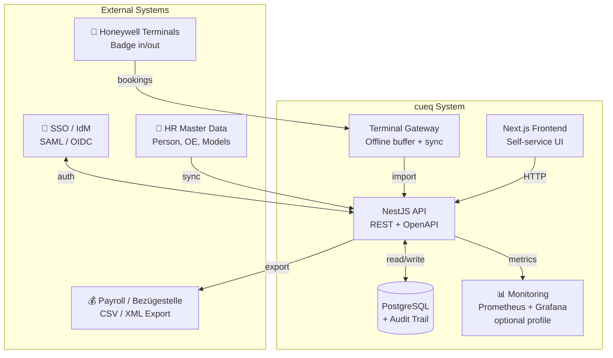
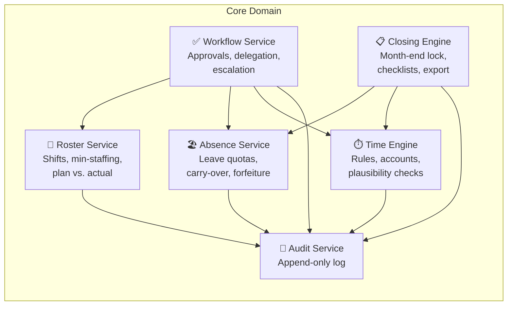
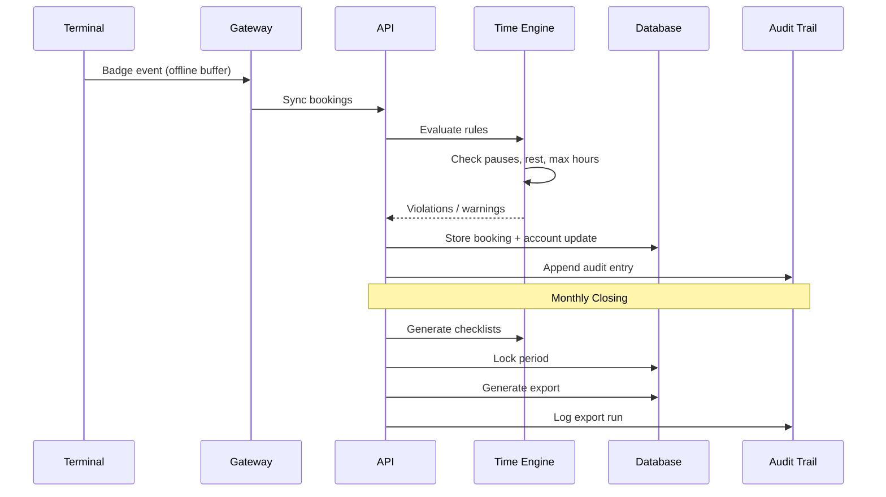
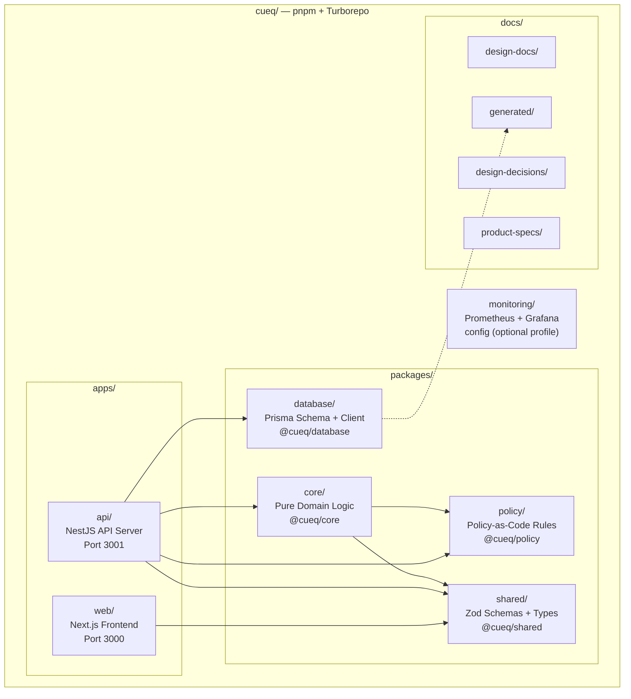
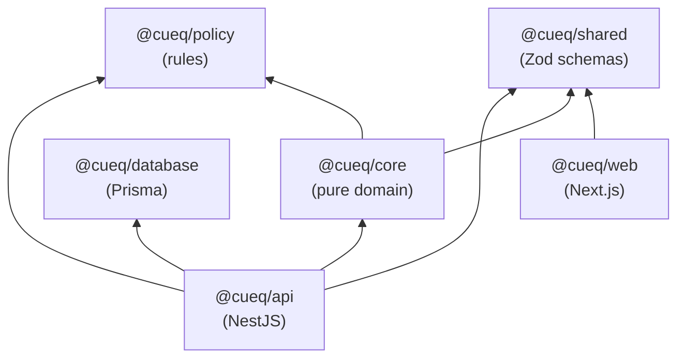
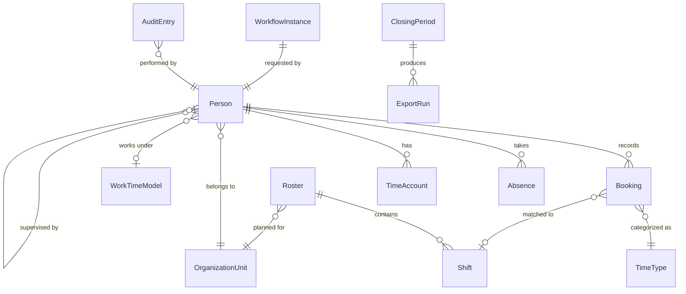

# cueq

> Time-tracking, absence management, and shift planning for a German university (NRW / TV-L).

[](https://github.com/sebastianspicker/cueq/actions/workflows/ci.yml)
[](LICENSE)

**Target Audience:** German university HR departments, team leads (Teamleitungen), and shift planners (Dienstplaner) managing workforce time-tracking, absence quotas, and roster compliance under TV-L / NRW regulations.

**Project Status:** cueq is a proof of concept and reference implementation, not
a certified production system or legal opinion. The current source implements
the major domain, API, web, integration, and operations capability families;
service-backed release gates still need to pass in an authorized environment.
See [Current Implementation Status](docs/PLANS.md) and the latest
[Local Verification Snapshot](docs/verification-baseline.md).

---

## What is cueq?

**cueq** (pronounced "cue-Q") is a workforce-management reference system for
German universities operating under the
[TV-L](https://de.wikipedia.org/wiki/Tarifvertrag_f%C3%BCr_den_%C3%B6ffentlichen_Dienst_der_L%C3%A4nder)
collective agreement in
[Nordrhein-Westfalen (NRW)](https://de.wikipedia.org/wiki/Nordrhein-Westfalen).
It explores how fragmented time, leave, roster, approval, and closing workflows
can be brought into one auditable, permission-aware, self-hostable application.

### The Problem

Universities have diverse workforce models under one roof:

- **Office administration** — flextime (Gleitzeit) with core hours
- **Security desk (Pforte)** — 24/7 shift operations with minimum staffing
- **IT department** — regular hours plus on-call rotations (Rufbereitschaft) with callout events
- **Facility services (Hausdienst)** — shifts, outdoor assignments, seasonal peaks (e.g. winter service)
- **Event technology (Veranstaltungstechnik)** — irregular evenings/weekends, setup/teardown time

Each group has different rules for working time, surcharges, leave quotas, and shift planning — all governed by TV-L, NRW labor law, and internal works agreements (Dienstvereinbarung). Currently, there is no integrated system that handles all of these correctly, transparently, and with proper audit trails.

### The Solution

cueq provides:

| Capability             | Description                                                                                                                      |
| ---------------------- | -------------------------------------------------------------------------------------------------------------------------------- |
| **Time Recording**     | Honeywell terminal integration (badge in/out) + web self-service for corrections, remote work, on-call deployments               |
| **Rule Engine**        | Configurable rules for pause enforcement, rest periods, maximum hours, overtime — per employee group                             |
| **Shift Planning**     | Roster creation with templates, rotations, minimum staffing, qualification requirements, and plan-vs-actual comparison           |
| **Absence Management** | Leave requests with quota tracking (pro-rata, carry-over, forfeiture), sick-leave recording, team calendar with privacy controls |
| **Approval Workflows** | Configurable approval chains with delegation, escalation, and automatic deputy routing                                           |
| **Monthly Closing**    | Structured end-of-month process: checklists, locking, HR corrections, and payroll export                                         |
| **Audit Trail**        | Immutable, append-only log of every change, decision, and export — required for legal compliance                                 |
| **Privacy Guardrails** | Role-based data access, configurable retention/deletion, no individual performance monitoring                                    |

### Key Constraints

- **No telemetry** — the system never phones home or collects usage analytics
- **Privacy by default** — colleagues see "absent", never "sick"; reports are aggregated to prevent individual identification
- **Works council (Personalrat) compatible** — reporting limits are built into the architecture, not bolted on
- **Offline resilient** — terminals buffer data locally; the system handles sync and conflict resolution

---

## Architecture

### System Context


```mermaid
graph TB
    subgraph External Systems
        HW[🏢 Honeywell Terminals<br/>Badge in/out]
        IDP[🔐 SSO / IdM<br/>SAML / OIDC]
        HR[👤 HR Master Data<br/>Person, OE, Models]
        PAY[💰 Payroll / Bezügestelle<br/>CSV / XML Export]
    end

    subgraph cueq System
        GW[Terminal Gateway<br/>Offline buffer + sync]
        API[NestJS API<br/>REST + OpenAPI]
        WEB[Next.js Frontend<br/>Self-service UI]
        DB[(PostgreSQL<br/>+ Audit Trail)]
        MON[📊 Monitoring<br/>Prometheus + Grafana<br/>optional profile]
    end

    HW -->|bookings| GW
    GW -->|import| API
    WEB -->|HTTP| API
    IDP <-->|auth| API
    HR -->|sync| API
    API -->|export| PAY
    API <-->|read/write| DB
    API -->|metrics| MON
```

### Core Domain Services


```mermaid
graph LR
    subgraph Core Domain
        TE[⏱️ Time Engine<br/>Rules, accounts,<br/>plausibility checks]
        RS[📅 Roster Service<br/>Shifts, min-staffing,<br/>plan vs. actual]
        AB[🏖️ Absence Service<br/>Leave quotas,<br/>carry-over, forfeiture]
        WF[✅ Workflow Service<br/>Approvals, delegation,<br/>escalation]
        CL[📋 Closing Engine<br/>Month-end lock,<br/>checklists, export]
        AU[📝 Audit Service<br/>Append-only log]
    end

    TE --> AU
    RS --> AU
    AB --> AU
    WF --> AU
    CL --> AU
    WF --> TE
    WF --> AB
    WF --> RS
    CL --> TE
    CL --> AB
```

### Data Flow


```mermaid
sequenceDiagram
    participant T as Terminal
    participant G as Gateway
    participant A as API
    participant E as Time Engine
    participant D as Database
    participant X as Audit Trail

    T->>G: Badge event (offline buffer)
    G->>A: Sync bookings
    A->>E: Evaluate rules
    E->>E: Check pauses, rest, max hours
    E-->>A: Violations / warnings
    A->>D: Store booking + account update
    A->>X: Append audit entry

    Note over A,X: Monthly Closing
    A->>E: Generate checklists
    A->>D: Lock period
    A->>D: Generate export
    A->>X: Log export run
```

---

## Monorepo Structure


```mermaid
graph TD
    subgraph Monorepo ["cueq/ — pnpm + Turborepo"]
        subgraph Apps ["apps/"]
            API["api/<br/>NestJS API Server<br/>Port 3001"]
            WEB["web/<br/>Next.js Frontend<br/>Port 3000"]
        end

        subgraph Packages ["packages/"]
            CORE["core/<br/>Pure Domain Logic<br/>@cueq/core"]
            DB["database/<br/>Prisma Schema + Client<br/>@cueq/database"]
            POL["policy/<br/>Policy-as-Code Rules<br/>@cueq/policy"]
            SH["shared/<br/>Zod Schemas + Types<br/>@cueq/shared"]
        end

        subgraph Docs ["docs/"]
            DD[design-docs/]
            ADR[design-decisions/]
            PS[product-specs/]
            GEN[generated/]
        end

        MON["monitoring/<br/>Prometheus + Grafana<br/>config (optional profile)"]
    end

    API --> DB
    API --> CORE
    CORE --> POL
    CORE --> SH
    API --> POL
    API --> SH
    WEB --> SH
    DB -.-> GEN
```

### Dependency Graph


```mermaid
graph BT
    CORE["@cueq/core<br/>(pure domain)"]
    DB["@cueq/database<br/>(Prisma)"]
    POL["@cueq/policy<br/>(rules)"]
    SH["@cueq/shared<br/>(Zod schemas)"]
    API["@cueq/api<br/>(NestJS)"]
    WEB["@cueq/web<br/>(Next.js)"]

    API --> CORE
    API --> DB
    API --> POL
    API --> SH
    CORE --> POL
    CORE --> SH
    WEB --> SH
```

### Directory Layout

```
cueq/
├── apps/
│   ├── api/                    # NestJS API server
│   │   ├── src/
│   │   │   ├── main.ts         # Bootstrap + Swagger/OpenAPI setup
│   │   │   ├── app.module.ts   # Root module
│   │   │   └── health/         # Health check controller
│   │   ├── nest-cli.json
│   │   ├── tsconfig.json
│   │   └── package.json
│   └── web/                    # Next.js frontend
│       ├── src/app/
│       │   ├── layout.tsx      # Root layout
│       │   └── [locale]/       # DE/EN role-aware application routes
│       ├── next.config.ts
│       ├── tsconfig.json
│       └── package.json
│
├── packages/
│   ├── core/                   # Pure domain logic (time, absence, workflow, roster, closing, audit)
│   │   ├── src/core/
│   │   ├── src/index.ts
│   │   └── package.json
│   ├── database/               # Prisma schema + generated client
│   │   ├── prisma/
│   │   │   └── schema.prisma   # Current storage contract
│   │   ├── src/index.ts        # Re-exports PrismaClient
│   │   └── package.json
│   ├── policy/                 # Policy-as-code definitions + golden tests
│   │   ├── src/rules/
│   │   └── package.json
│   └── shared/                 # Shared validation & types
│       ├── src/
│       │   ├── index.ts
│       │   ├── generated/      # Generated types from JSON Schemas
│       │   └── schemas/
│       │       ├── common.ts   # ID, DateTime, Pagination, ApiError
│       │       ├── booking.ts  # CreateBooking, BookingCorrection
│       │       ├── absence.ts  # CreateAbsence, LeaveBalance
│       │       ├── time-type.ts # TimeTypeCategory, BookingSource
│       │       └── workflow.ts # WorkflowDecision, WorkflowInstance
│       └── package.json
│
├── docs/                       # Full documentation suite
│   ├── design-docs/            # Core beliefs, glossary
│   ├── design-decisions/       # ADRs (template + 001-tech-stack)
│   ├── generated/              # Auto-generated (db-schema.md)
│   ├── product-specs/          # Product specifications
│   ├── README.md               # Public documentation index and boundary
│   ├── DESIGN.md               # Domain/application design patterns
│   ├── FRONTEND.md             # Frontend architecture
│   ├── PLANS.md                # Current implementation and release status
│   ├── PRODUCT_SENSE.md        # Product thinking & personas
│   ├── QUALITY_SCORE.md        # Quality metrics & targets
│   ├── RELIABILITY.md          # Ops, failover, backup
│   └── SECURITY.md             # Threat model, GDPR, RBAC
│
│
├── schemas/                    # JSON Schema source-of-truth contracts
│   ├── domain/                 # Domain entity schemas (Person, Booking, Absence, ...)
│   └── fixtures/               # Fixture schema contracts
│
├── fixtures/                   # Synthetic reference calculation fixtures
│   └── reference-calculations/
│
├── contracts/                  # Checked-in API/schema contracts
│   └── openapi/
│       └── openapi.json        # Committed OpenAPI snapshot
│
├── scripts/                    # Harness scripts used by Makefile/CI
│   ├── setup.sh
│   ├── check.sh
│   ├── schemas.sh
│   ├── generate.sh
│   └── openapi-check.sh
│
├── .github/workflows/ci.yml   # CI: harness validation + fresh-clone smoke
├── docker-compose.yml          # PostgreSQL 16 for local dev
├── Makefile                    # Standard commands interface
├── turbo.json                  # Turborepo build pipeline
├── pnpm-workspace.yaml         # Monorepo workspace config
├── tsconfig.json               # Strict TypeScript base config
├── .prettierrc                 # Code formatting
├── .editorconfig               # Editor consistency
├── .env.example                # Environment template
├── AGENTS.md                   # Contributor guide
├── ARCHITECTURE.md             # System architecture
├── PRODUCT.md                  # Product purpose, users, and principles
├── DESIGN.md                   # Trusted Operations Desk visual system
├── README.md                   # ← You are here
└── LICENSE                     # MIT
```

---

## Maintainer Orientation

If you are a competent programmer or IT operator coming to cueq cold, read the
repository in this order:

1. `README.md` for product scope, setup, commands, and the directory map.
2. `ARCHITECTURE.md` for the domain boundaries and the API request path.
3. `docs/product-specs/index.md` for the implemented feature contracts.
4. `docs/FRONTEND.md` for the Next.js route surface and API client pattern.
5. `docs/OPERATIONS_RUNBOOK.md` for terminal, HR import, export, backup, and
   incident procedures.

The main runtime path is:

| Concern                 | Start here                               | Follow-up files                                                     |
| ----------------------- | ---------------------------------------- | ------------------------------------------------------------------- |
| Web UI                  | `apps/web/src/app/[locale]/*/page.tsx`   | `apps/web/src/lib/api-client.ts`, `apps/web/src/messages/*.json`    |
| API bootstrap           | `apps/api/src/main.ts`                   | `apps/api/src/app.module.ts`, `apps/api/src/openapi.ts`             |
| Operational API surface | `apps/api/src/phase2/`                   | `controllers/` -> `services/` -> `helpers/`                         |
| Pure domain rules       | `packages/core/src/core/`                | adjacent `*.test.ts` files and reference fixtures                   |
| Runtime contracts       | `packages/shared/src/schemas/`           | `schemas/domain/`, `contracts/openapi/openapi.json`                 |
| Persistence             | `packages/database/prisma/schema.prisma` | `packages/database/prisma/migrations/`                              |
| Verification harness    | `Makefile`                               | `scripts/check.sh`, `turbo.json`, package `vitest*.config.ts` files |

For a typical request, trace from a localized page to the shared API client,
then to the matching Nest controller. Controllers keep transport concerns thin;
domain services coordinate authorization, transactions, persistence, audit, and
side effects; helpers isolate sub-domain logic; reusable calculations belong in
`@cueq/core` where they can be tested without NestJS or Prisma.

---

## Tech Stack

| Layer          | Technology             | Purpose                                             |
| -------------- | ---------------------- | --------------------------------------------------- |
| **Monorepo**   | pnpm + Turborepo       | Workspace management, parallel builds, caching      |
| **Backend**    | NestJS (TypeScript)    | Modular API framework with built-in OpenAPI support |
| **Frontend**   | Next.js 15 + React 19  | Server-rendered UI with App Router                  |
| **Database**   | PostgreSQL 16 + Prisma | Type-safe ORM with migration management             |
| **Validation** | Zod                    | Runtime validation shared across API + UI           |
| **API Docs**   | @nestjs/swagger        | OpenAPI spec generated from decorators              |
| **Testing**    | Vitest + Playwright    | Unit/integration tests and browser E2E coverage     |
| **CI/CD**      | GitHub Actions         | Automated lint, typecheck, test, build              |
| **Dev Tools**  | Docker Compose         | Local PostgreSQL, reproducible environment          |

See [ADR-001: Tech Stack](docs/design-decisions/001-tech-stack.md) for the full rationale.

---

## Quick Start

**Prerequisites:** Node.js >= 20, pnpm >= 9, Docker (for PostgreSQL).

```bash
# 1. Clone and configure
git clone https://github.com/sebastianspicker/cueq.git
cd cueq
cp .env.example .env          # adjust DATABASE_URL if needed

# 2. Setup everything (deps, Docker DB, Prisma generate + push)
make setup

# 3. Start development servers
make dev
# -> Web:     http://localhost:3000  (Next.js frontend, German by default)
# -> API:     http://localhost:3001  (NestJS REST API)
# -> Swagger: http://localhost:3001/api/docs  (OpenAPI explorer, dev only)

# 4. Run full validation (lint, typecheck, tests, schema checks)
make check
```

`make check`, browser tests, and service-backed suites require the local
PostgreSQL service. Do not infer release readiness from unit/build results alone.

## Standard Commands

Run `make help` for a full list. Key commands:

| Command                 | Description                                                                                         |
| ----------------------- | --------------------------------------------------------------------------------------------------- |
| `make setup`            | Install dependencies, start Docker, generate Prisma client, push schema                             |
| `make dev`              | Start API + Web with hot reload                                                                     |
| `make check`            | Full validation: hygiene + lint + format + typecheck + docs links + schemas + tests + OpenAPI drift |
| `make quick`            | Fast local validation: lint + typecheck + unit tests only                                           |
| `make docs-check`       | Validate internal markdown links only                                                               |
| `make hygiene-check`    | Reject private, local-only, and generated artifacts tracked by Git                                  |
| `make lint`             | Run linters (check mode)                                                                            |
| `make lint-fix`         | Auto-fix lint + format                                                                              |
| `make typecheck`        | TypeScript type checking                                                                            |
| `make schemas`          | Validate JSON Schemas and fixture contracts                                                         |
| `make generate`         | Generate Prisma client, OpenAPI snapshot, and generated schema docs                                 |
| `make openapi-check`    | Compare generated OpenAPI spec against committed snapshot                                           |
| `make test`             | Run all tests                                                                                       |
| `make test-e2e`         | Run browser E2E tests against the built web app and local API                                       |
| `make test-all`         | Run all test suites (unit + integration + acceptance + compliance + backup/restore)                 |
| `make demo-screenshots` | Generate local German demo screenshots using mock-university seed data                              |
| `make build`            | Build all packages and apps                                                                         |
| `make db-generate`      | Regenerate Prisma client after schema change                                                        |
| `make db-migrate`       | Run database migrations                                                                             |
| `make clean`            | Stop Docker, remove artifacts                                                                       |

---

## End-to-End Tests

Browser E2E tests use the existing Playwright harness in
`apps/web/tests/acceptance`. The harness starts the NestJS API on port `3001`
and a production-built Next.js app on port `3000`, then exercises the real UI
against a deterministic PostgreSQL schema named `web_acceptance`.

```bash
# From a clean checkout, run setup once so dependencies, Prisma, and Postgres exist.
make setup

# Browser E2E only.
make test-e2e

# Full acceptance suite, including browser E2E plus service/package acceptance.
make test-acceptance
```

The E2E suite uses mock bearer tokens and synthetic seed data only. It does not
call external services or require secrets.

---

## Domain Model

The database schema models the core domain entities from the [PRD](docs/product-specs/index.md).
Core entities shown below; Phase 2/3 integration models (OnCall, Webhooks, Terminals, HrImport, WorkflowPolicy, TimeThresholdPolicy) are omitted for clarity — see [`docs/generated/db-schema.md`](docs/generated/db-schema.md) for the full schema.


```mermaid
erDiagram
    Person ||--o{ Booking : "records"
    Person ||--o{ Absence : "takes"
    Person ||--o{ TimeAccount : "has"
    Person }o--|| OrganizationUnit : "belongs to"
    Person }o--o| WorkTimeModel : "works under"
    Person }o--o| Person : "supervised by"

    Booking }o--|| TimeType : "categorized as"
    Booking }o--o| Shift : "matched to"

    Roster ||--o{ Shift : "contains"
    Roster }o--|| OrganizationUnit : "planned for"

    ClosingPeriod ||--o{ ExportRun : "produces"

    WorkflowInstance ||--|| Person : "requested by"

    AuditEntry }o--|| Person : "performed by"
```

---

## Documentation Map

| Document                                                       | Description                                             | Audience                   |
| -------------------------------------------------------------- | ------------------------------------------------------- | -------------------------- |
| [PRODUCT.md](PRODUCT.md)                                       | Current users, purpose, principles, and role model      | Everyone                   |
| [DESIGN.md](DESIGN.md)                                         | Trusted Operations Desk visual system                   | Product, frontend          |
| [AGENTS.md](AGENTS.md)                                         | Contributor conventions and verification expectations   | Developers, contributors   |
| [ARCHITECTURE.md](ARCHITECTURE.md)                             | System overview and dependency boundaries               | Developers, architects     |
| [docs/README.md](docs/README.md)                               | Public documentation index and public/private boundary  | Everyone                   |
| [docs/PLANS.md](docs/PLANS.md)                                 | Current implementation and release-verification status  | Maintainers                |
| [docs/verification-baseline.md](docs/verification-baseline.md) | Latest observed local verification and gaps             | Maintainers, reviewers     |
| [docs/SECURITY.md](docs/SECURITY.md)                           | Threat model, role matrix, and privacy design           | Security, DPO, Personalrat |
| [SECURITY.md](SECURITY.md)                                     | GitHub vulnerability disclosure entry point             | Security reporters         |
| [docs/RELIABILITY.md](docs/RELIABILITY.md)                     | Availability, backup, failover, and monitoring          | Operations                 |
| [docs/QUALITY_SCORE.md](docs/QUALITY_SCORE.md)                 | Quality targets and enforcing commands                  | QA, CI                     |
| [docs/FRONTEND.md](docs/FRONTEND.md)                           | Current UI architecture, i18n, accessibility, and roles | Frontend developers        |
| [docs/product-specs/](docs/product-specs/index.md)             | Capability specifications                               | Product, developers        |

---

## Contributing

See [AGENTS.md](AGENTS.md) for the full guide. Key points:

- **Focused PRs** — one coherent concern with reviewable evidence
- **Conventional Commits** — `type(scope): description`
- **Tests required** — new behavior must have tests
- **No secrets** — use `.env.example` for templates
- **No telemetry** — this is a university system with strict privacy requirements

---

## License

[MIT](LICENSE) — Copyright (c) 2026 Sebastian J. Spicker
