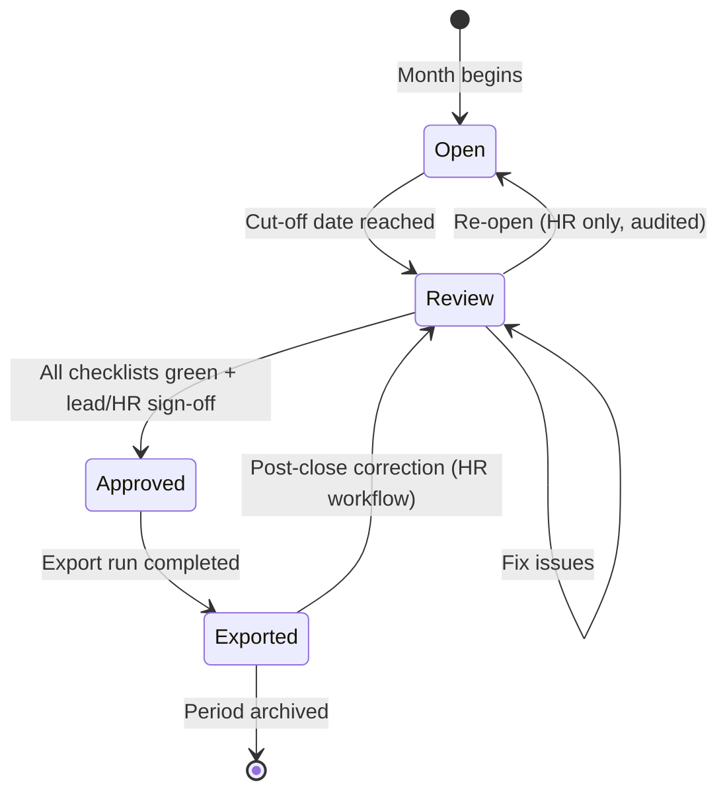

# Product Spec: Closing Console

> **CueQ Differentiator B** — Audit-ready monthly close as a first-class workflow.
> **Status:** ✅ MVP Implemented

---

## 1. Summary

The Closing Console is CueQ's structured end-of-month process that replaces ad-hoc Excel reconciliation with a traceable, audit-grade workflow. It has dedicated UI and API surfaces, not tucked away in admin settings.

## 2. Closing Workflow

## 3. Checklist Items (auto-generated)

| Check                    | Severity   | Description                                   |
| ------------------------ | ---------- | --------------------------------------------- |
| Missing bookings         | 🔴 Error   | Days with no clock-in/out and no absence      |
| Booking gaps             | 🟡 Warning | Periods between bookings exceeding threshold  |
| Open correction requests | 🔴 Error   | Unapproved workflow instances                 |
| Open leave requests      | 🟡 Warning | Pending approval; may affect balances         |
| Rule violations          | 🔴 Error   | Rest period, max hours, or break violations   |
| Roster mismatches        | 🟡 Warning | Plan-vs-actual discrepancies not acknowledged |
| Balance anomalies        | 🟡 Warning | Balance exceeding configured cap              |

## 4. Approval Gates

1. **Employee self-review** (optional, configurable per OE): employee confirms their month
2. **Team lead approval**: certifies team data is complete
3. **HR approval**: final sign-off; triggers export eligibility
4. **Post-close correction**: available only to HR role; creates audited correction entries

## 5. Export Run Log

Each export produces an `ExportRun` record with:

- Timestamp, format (CSV/XML), record count, SHA-256 checksum
- Idempotent: re-running with unchanged data produces identical output
- Logged in audit trail with full metadata

## 6. UI Surface

The Closing Console will be a dedicated view at `/closing` with:

- Month selector with status badges (Open / Review / Approved / Exported)
- Checklist panel with drill-down to individual items
- Approval buttons with confirmation dialogs
- Export trigger with progress indicator
- Post-close correction panel (HR role only)

The Closing Console UI is implemented in `apps/web` and backed by production API routes in `apps/api`.

## 7. References

- [`packages/database/prisma/schema.prisma`](../../packages/database/prisma/schema.prisma) — `ClosingPeriod`, `ExportRun` models
