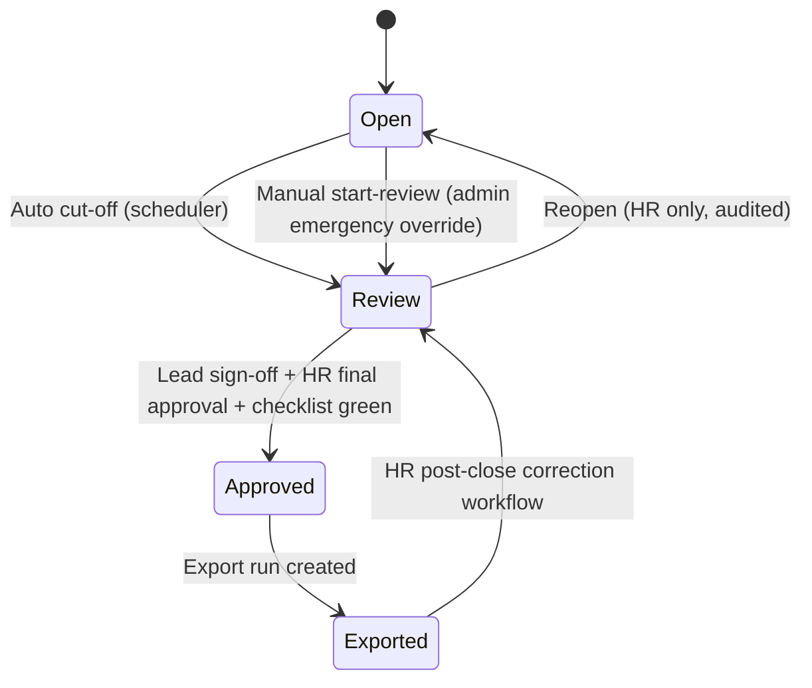

# Product Spec: Monthly Closing (FR-600)

> **Status:** ✅ Implemented
> **Source:** PRD FR-600

---

## 1. Summary

Monthly Closing is the audited end-of-month process for each organization unit (or global scope) that enforces:

- cut-off transition (`OPEN -> REVIEW`) at configured deadline
- checklist-based readiness gates
- dual approval (team lead sign-off, then HR final approval)
- lock-aware correction workflow for post-close adjustments

## 2. State Model

## 3. Roles and Permissions

| Action                      | Team Lead   | HR/Admin | Employee |
| --------------------------- | ----------- | -------- | -------- |
| Read closing periods        | ✅ (own OE) | ✅       | ❌       |
| Lead approve                | ✅ (own OE) | ❌       | ❌       |
| HR final approve            | ❌          | ✅       | ❌       |
| Export                      | ❌          | ✅       | ❌       |
| Reopen                      | ❌          | ✅       | ❌       |
| Post-close correction apply | ❌          | ✅       | ❌       |

## 4. Lock Behavior

- Any period in `REVIEW`, `APPROVED`, or `EXPORTED` is lock-protected.
- Mutable flows (bookings, absences, leave adjustments, roster writes) must reject with `409` and code `CLOSING_PERIOD_LOCKED` when overlapping a locked period.
- Lock metadata is stored on period:
- `lockedAt`
- `lockSource` (`AUTO_CUTOFF`, `MANUAL_REVIEW_START`, `HR_CORRECTION`)

## 5. Checklist Requirements

Checklist output remains deterministic for identical inputs. Minimum checks:

- Missing bookings
- Booking gaps above configured threshold
- Open correction requests
- Open leave requests
- Rule violations
- Roster mismatches
- Balance anomalies above configured cap

Approval gate:

- HR final approval is blocked while unresolved `ERROR` checklist items exist.

## 6. Dual Approval Gate

- Team lead sign-off is mandatory for OU-scoped periods before HR final approval.
- Global periods (`organizationUnitId = null`) can skip lead approval.
- Reopen clears lead and HR approvals and returns period to `OPEN`.

## 7. Post-Close Corrections

- HR creates post-close correction workflow from exported period.
- Approved correction workflows can apply controlled correction bookings in locked periods.
- Corrections are fully audited (`POST_CLOSE_CORRECTION_APPLIED`) and force re-approval/re-export flow.

## 8. Operational Defaults

- `CLOSING_AUTO_CUTOFF_ENABLED=true`
- `CLOSING_CUTOFF_DAY=3`
- `CLOSING_CUTOFF_HOUR=12`
- `CLOSING_TIMEZONE=Europe/Berlin`
- `CLOSING_BOOKING_GAP_MINUTES=240`
- `CLOSING_BALANCE_ANOMALY_HOURS=40`
- `CLOSING_ALLOW_MANUAL_REVIEW_START=false`

## 9. References

- [docs/product-specs/phase-2-acceptance-scenarios.md](./phase-2-acceptance-scenarios.md)
- [docs/product-specs/phase-3-acceptance-scenarios.md](./phase-3-acceptance-scenarios.md)
- [docs/OPERATIONS_RUNBOOK.md](../OPERATIONS_RUNBOOK.md)
